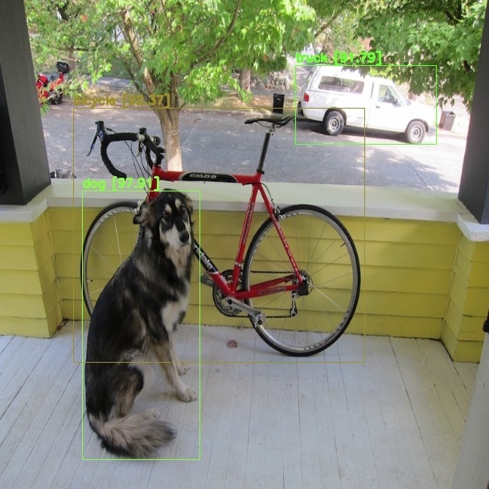

# YOLOv4 Darknet Real-Time Object Detection

YOLOv4 — the most accurate real-time neural network on MS COCO dataset.


本專案使用兩個方法來實現 YOLO 物件偵測。

1. Darknet 原作者寫的 python API
2. OpenCV DNN Module

## Requirement

- Python 3.9.18
- CUDA Toolkit 11.0.3
- cuDNN v8.0.5

## Installed

- Numpy
  
  ```bash
  pip install numpy
  ```

- OpenCV

  ```bash
  pip install opencv-python
  pip install opencv-contrib-python
  ```

## Folder

- cfg: [yolov4.cfg](https://github.com/AlexeyAB/darknet/blob/master/cfg/yolov4.cfg)

- data: [coco.data](https://github.com/AlexeyAB/darknet/blob/master/cfg/coco.data), [coco.names](https://github.com/AlexeyAB/darknet/blob/master/cfg/coco.names)

- Download `yolov4.weights` file: [yolov4.weights](https://github.com/AlexeyAB/darknet/releases/download/darknet_yolo_v3_optimal/yolov4.weights)

- yolo: [YOLOv4 Darknet](https://github.com/AlexeyAB/darknet) 編譯過的函式庫

:pushpin: Faster

- cfg: [yolov4-tiny.cfg](https://github.com/AlexeyAB/darknet/blob/master/cfg/yolov4-tiny.cfg)

- Download `yolov4-tiny.weights` file: [yolov4.weights](https://github.com/AlexeyAB/darknet/releases/download/darknet_yolo_v4_pre/yolov4-tiny.weights)

## Usage

- Training Example
  [](https://colab.research.google.com/drive/1_GdoqCJWXsChrOiY8sZMr_zbr_fH-0Fg)

- Detection from file
  
  ```bash
  python darknet_file.py
  ```

  ```bash
  python opencv_dnn_file.py
  ```

  

- Detection from webcam
  
  ```bash
  python darknet_realtime.py
  ```

  ```bash
  python opencv_dnn_realtime.py
  ```

## Contact

[](terrell60813@gmail.com) [](https://www.linkedin.com/in/yuntw/)
